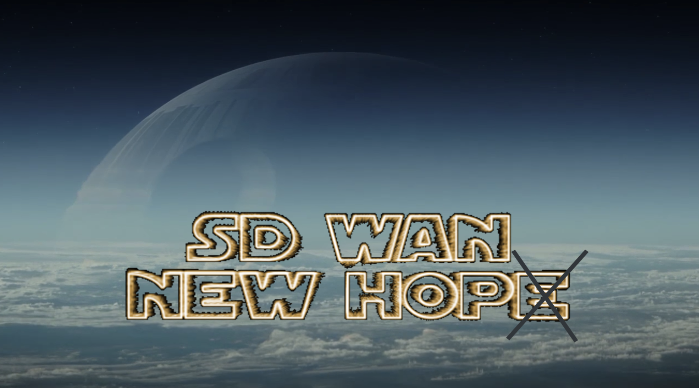

# SD-WAN New Hope

Software-defined networking in a wide area network (SD-WAN) quickly becomes very popular in Enterprises. Vendors promise "on-the-fly agility, simplicity, security and automation" and many other benefits. 
What do you know about SD-WAN? What the "security" means from a hands-on perspective? Are present SD-WAN products really secure? 
The goal of this project is to give answers on these questions by exploring security of SD-WAN solutions from a practical point of view.

## Papers
* [SD-WAN Internet Census (preprint)](https://arxiv.org/abs/1808.09027)
* [SD-WAN Threat Landscape (preprint)](https://arxiv.org/abs/1811.04583)

## Knowledge Base
* [SD-WAN Census Queries List](docs/census.md)
* [SD-WAN Version Leakage List](docs/leakage.md)

## Public Reports
* [Citrix SD-WAN Center Security Findings](reports/Citrix%20SD-WAN%20Security%20Findings.pdf)
* [Citrix NetScaler SD-WAN Security Findings](reports/Citrix%20NetScaler%20SD-WAN%20Security%20Findings%20-%2011082018.pdf)
* [Silverpeak EdgeConnect Multiple Vulnerabilities](reports/Silverpeak%20EdgeConnect%20Multiple%20Vulnerabilities%20-%20032018.pdf)
* [Riverbed SteelConnect Vulnerabilities](reports/Riverbed%20SteelConnect%20Vulnerabilities.pdf)
* [Viprinet Virtual VPN Hub Stored XSS](reports/Viprinet%20Stored%20XSS.pdf) 

## Checklists
* [SD-WAN Security Assessment: The First Hours](checklists/sd-wan-security-assessment-the-first-hours.md)

## Tools
* [Grinder Framework](https://github.com/sdnewhop/grinder)
* [SD-WAN Harvester](https://github.com/sdnewhop/sdwan-harvester)
* [SD-WAN Infiltrator](https://github.com/sdnewhop/sdwan-infiltrator)

## Slides
* [One Framework to Rule Them All: A framework for Internet-connected Device Census. OFFZONE 2019](/slides/offzone-grinder-2019.pdf)
* [A dive in to SD-WAN Insecure Designs and Vulnerabilities. SecurityFest 2019](slides/securityfest-2019.pdf)
* [SD-WAN New Hope. PHDays 2019](slides/phdays-2019.pdf)
* [SD-WAN Secure Communications. Yandex OSN Meetup 2019](slides/yandex-osn-2019.pdf)
* [SD-WAN: Yet Another Way to Unsafe Internet. InsomniHack 2019](slides/insomnihack-2019.pdf)
* [SD-WAN Internet Census. Zero Nights 2018](slides/zn-2018.pdf)
* ["WebGoat.SDWAN.Net" in Depth. Power of Community 2018](slides/poc-2018.pdf)
* [Practical Threat Modeling for SD-WAN. Area 41 2018](slides/area41-2018.pdf)
* [Too Soft[ware Defined] Networks: SD-WAN Vulnerability Assessment. Black Hat USA 2018](slides/blackhat-2018.pdf)

## Talks
* [SD-WAN Secure Communications. Yandex OSN Meetup 2019 (Russian)](https://www.youtube.com/watch?v=gHRustiUdKY)
* [SD-WAN a New Hop. How to hack software defined network and keep your sanity? CCC 2018](https://media.ccc.de/v/35c3-9446-sd-wan_a_new_hop)
* [How To Hack SD-WAN And Keep Your Sanity? Ekoparty 2018](https://www.youtube.com/watch?v=8jY0yPlW7xg)

## Contributors
- [Sergey Gordeychik](https://twitter.com/scadasl)
- [Alex Timorin](https://twitter.com/atimorin)
- [Denis Kolegov](https://twitter.com/dnkolegov)
- Maxim Gorbunov
- [Nikolay Tkachenko](https://twitter.com/afr1ka_)
- [Nikita Oleksov](https://twitter.com/neoleksov)
- [Oleg Broslavsky](https://twitter.com/yalegko)
- [Anton Nikolaev](https://github.com/manmolecular)
